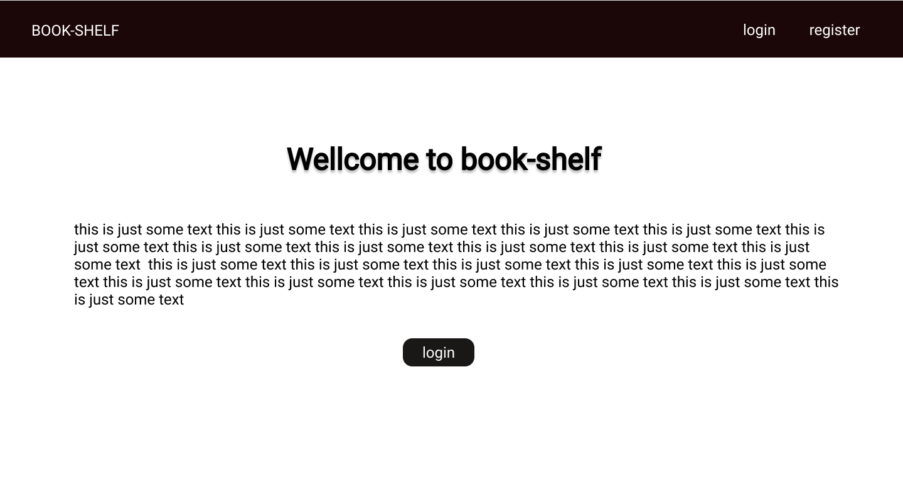
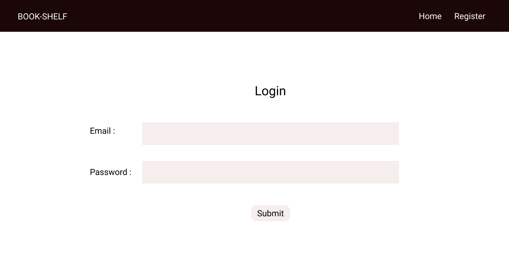
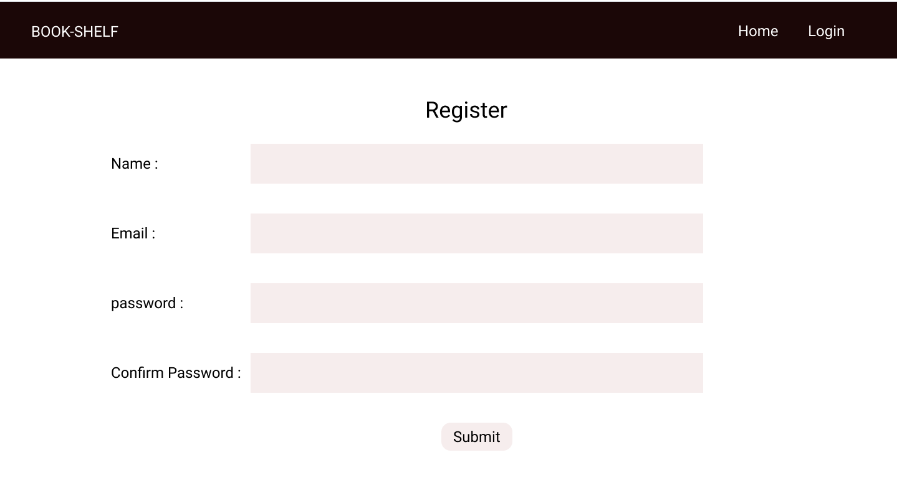
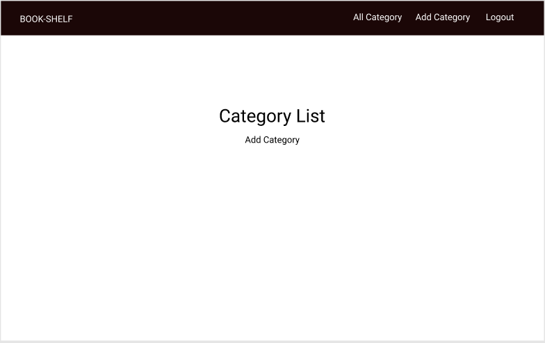
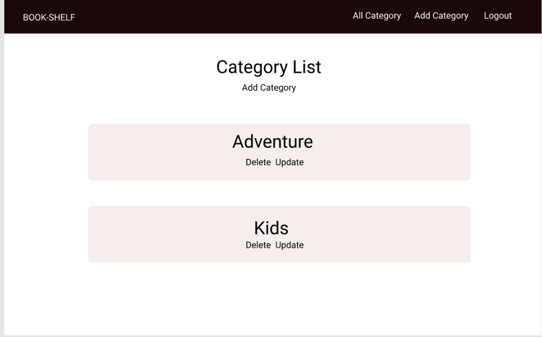
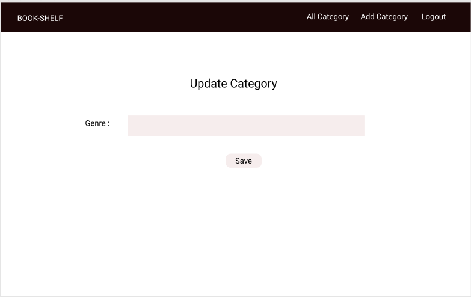
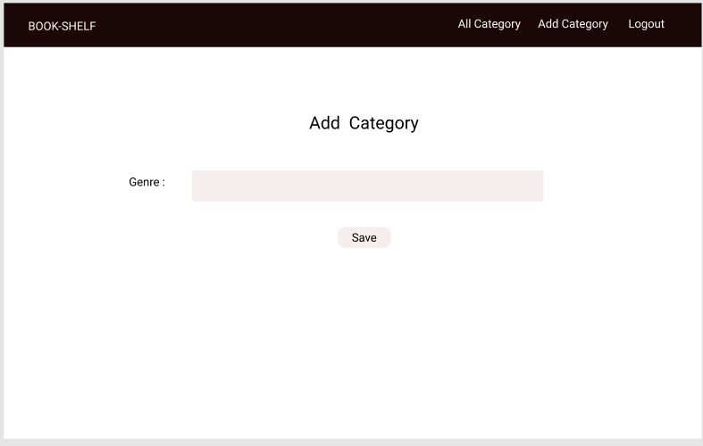
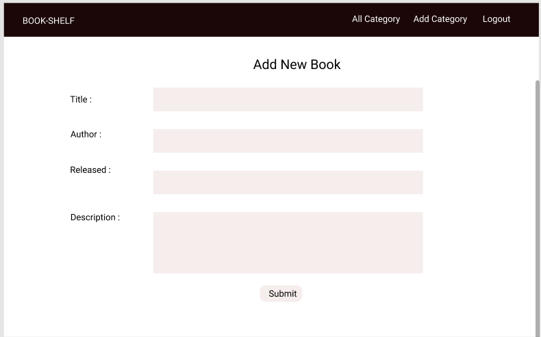
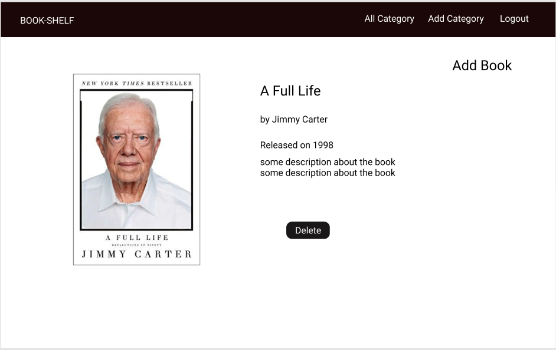
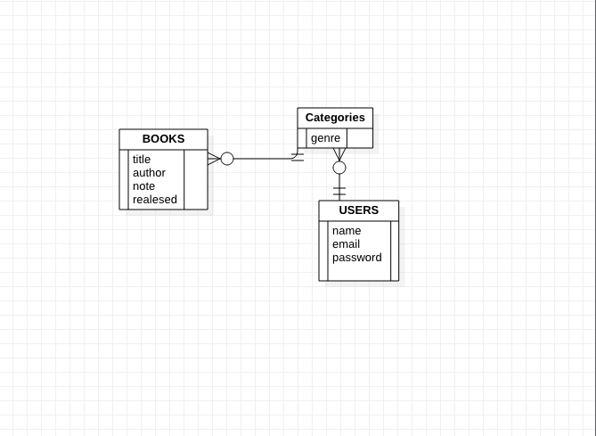

# Project 1: Full-Stack Website

By Freshta Bashari, SEI '20
## Book-Shelf, an Book collection app
A Book-Shelf is a varied categories of books. On Book-Shelf, a user can sign up to create, edit and view their categpories of books. inside each category they can add books and delete a books. 

## Scope
In this project, we fulfilled all core requirements. Our website has:
- Full CRUD on linked database model defined by Mongoose schema
- 7 RESTful routes for model
- User authentication and authorization using sessions and bcrypt 
- Front-end data validation
- Templating using the EJS view engine
- Responsive front-end styling using Bootstrap CSS
- Deployment to Heroku

## Technologies Used
- Front-end: React, Bootstrap, CSS, HTML,
- Back-end: Mongoose, MongoDB, Express, Node.js
- Dependencies: bcyptjs, body-parser, connect-mongo, ejs, express, express-session, method-override, mongoose

## User Stories
- User creates an account
- User logs in
- User logs out
- User add a Category
- User can edit and delete a Category
- User can add a book inside a category
- User can delete a Book

## Wireframes
During our planning, we used figma to create wireframes for each page.
1. Home Page   

2. Log In  

3. Register  

4. Profile  

5. All Categories  

6. Edit Category  

7. New Category  

8. New Book  

9. View Book  

## Data Models
Imagerie uses 2 linked models
1. Users: one-to-many relationship with Books
2. Categories: one-to-many relationship with user
2. Books: many-to-one relationship with user

